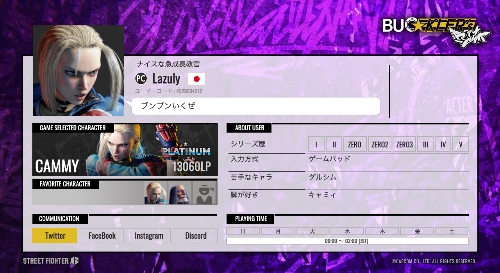

だいたい忘れるのと、GitHub/GitHub-Pagesの練習のために書き殴っています。

<b>[Lazuly's Pageはこちら](https://lazulyTech.github.io/)</b>

11月末にミャミィでルーキー1からはじまり、現在ゴールド3と4を反復横跳び中。

# キャミィ

- [キャミィの使い方](./Cammy/howto.html)
- [キャミィ目線のキャラ対](./Cammy/counter.html)

